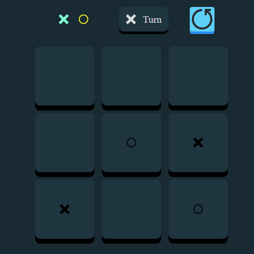

# Tic Tac Toe (Gato) - React Game 🎮

A simple yet functional Tic Tac Toe (Gato) game built with React.  
The user plays as **X**, and the computer plays as **O**. The computer picks empty positions randomly.

## 🧠 Features

- User vs Computer logic
- Automatic turn switching
- Random AI moves
- Win, lose or draw detection
- Responsive 3x3 grid
- React Hooks for state management
- Game result message + replay button

## 🛠 Technologies

- React
- CSS
- JavaScript
- [React Icons](https://react-icons.github.io/react-icons/)

## 📸 Screenshot

